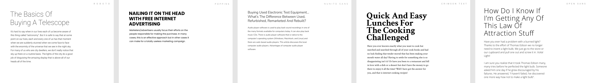
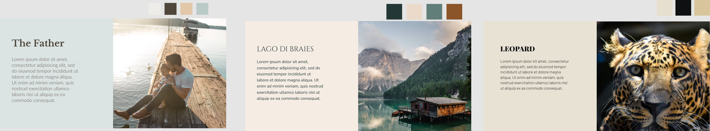
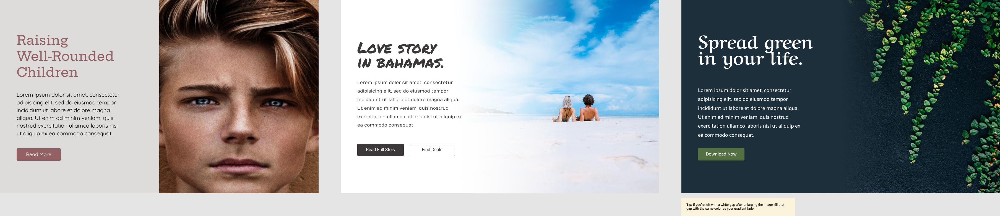
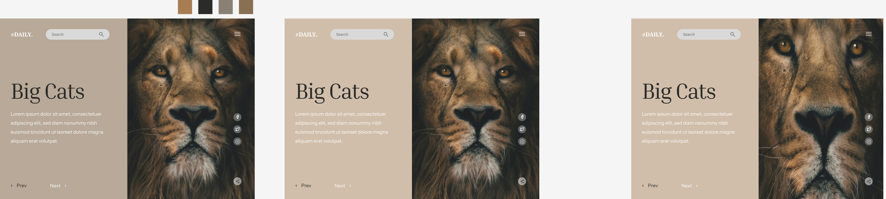
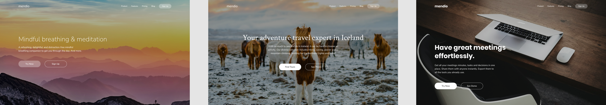
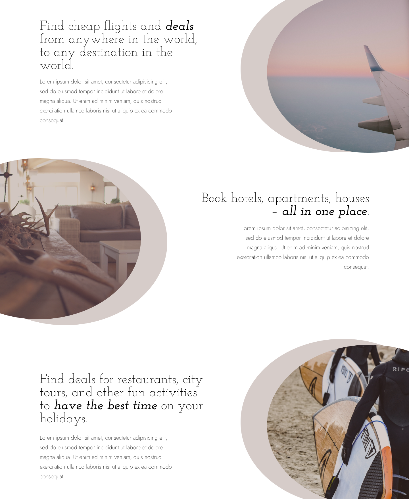

# Prototyping
## Some Design Exercises[¹] while working with Figma

### Pairing Typography

Combining Headings with paragraph while choosing suitable typefaces to emphasize context  

 

### Sampling Colors

Sampling Colors through images and pairing Typography

 

### Cropping Techniques

Cropping Images with extreme, soft blurring techniques while designing Landing Pages for random topics.

 

 

### Overlaying Images

Designing Landing Pages while following overlay techniques.

 

### Overlapping of Elements

Designing a Section Layout while using element overlapping.

 

### Creating Tension

Designing a Landing page using masking techniques.

 
-------------------------------------------------------------------------
 
[1] All exercises are inspired or are actual assignments from the udemy course taught by 